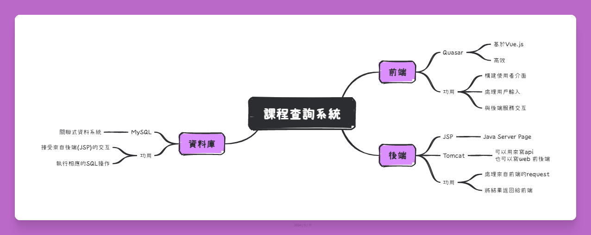
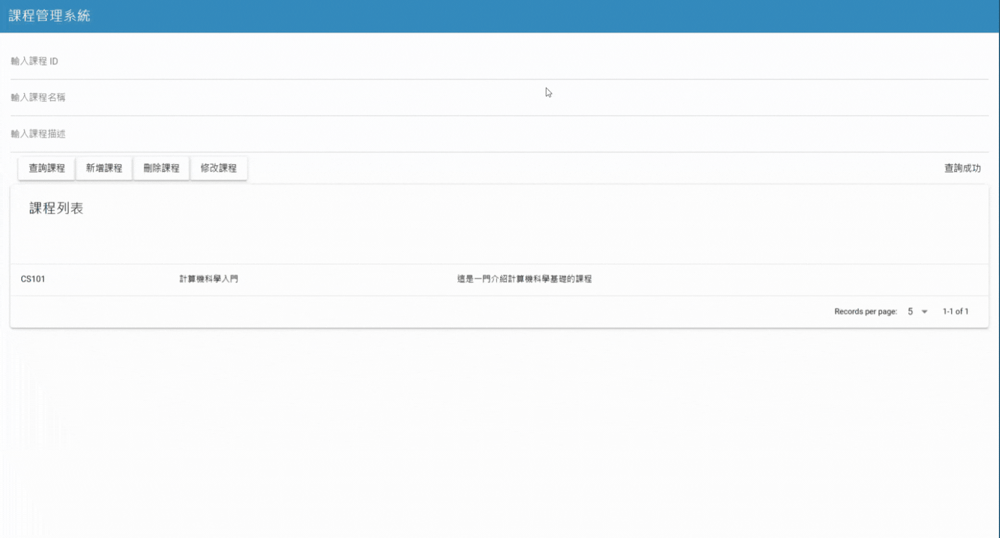
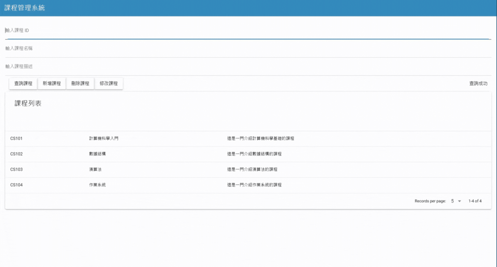
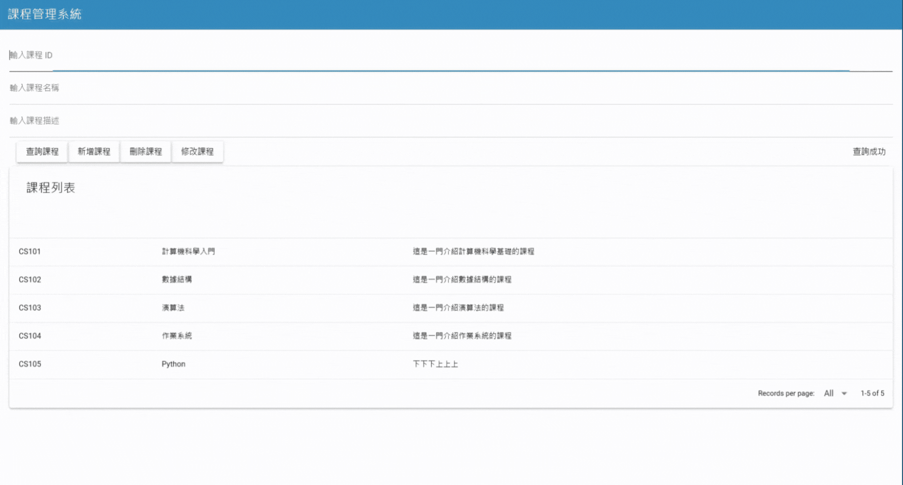
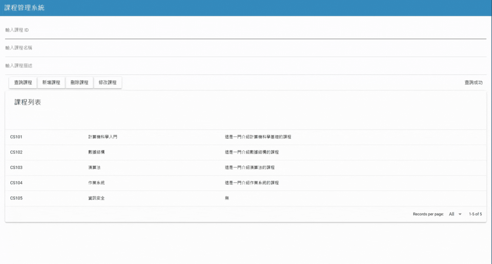

# 課程查詢系統

## 架構

- 前端: Quasar
- 後端: JSP(tomcat server)
- 資料庫: MySQL (or sqlite oracle)

## 系統功能
- 查詢課程
- 新增課程
- 刪除課程
- 修改課程

## 成果展示

### 查詢
- 查詢課程: 可以根據課程ID搜尋課程資訊。

### 新增
- 新增課程: 可以添加新的課程到系統中。

### 刪除
- 刪除課程: 可以從系統中刪除現有的課程。

### 修改
- 修改課程: 可以編輯現有的課程資訊。
