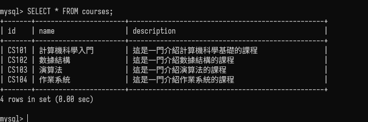
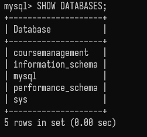

# MySQL

## MySQL 介紹

MySQL 是一個開源的關聯式資料庫管理系統，由瑞典 MySQL AB 公司開發，現在屬於 Oracle 旗下產品。MySQL 是最流行的關聯式資料庫管理系統之一，應用於網站應用中，如網站數據庫。MySQL 是一個快速、穩定、易用的 RDBMS，並且是開源的。MySQL 是一個很好的選擇，無論是在網站應用中還是在其他應用中。

## MySQL 指令

### 連線 MySQL

```bash
mysql -u root -p
```

### 檢查是否在運行

```bash
sc query [service_name]
```

### 啟動 MySQL

```bash
net start mysql
```

### 關閉 MySQL

```bash
net stop mysql
```

### 顯示所有資料庫

```sql
SHOW DATABASES;
```

### 選擇資料庫

```sql
USE database_name;
```

### 顯示資料庫所有表格

```sql
SHOW TABLES;
```

### 顯示表格結構

```sql
DESC table_name;
```

## 資料庫 與 表格

### 資料庫

- 資料庫是一個容器，用於存儲表格。
- 資料庫是一個物理容器，表格是一個邏輯概念。

### 表格


- 表格是一個結構化的資料集合。
- 表格是資料庫中的一個物件，用於存儲資料。

## Intellij 設定 JDBC

透過maven安裝mysql-connector-java
```xml
<dependency>
    <groupId>mysql</groupId>
    <artifactId>mysql-connector-java</artifactId>
    <version>8.0.33</version>
</dependency>
```
## 參考資料

- [MySQL 官方網站](https://www.mysql.com/)
- [MySQL - 維基百科](https://zh.wikipedia.org/wiki/MySQL)